# 💰 PayFlow — School Payroll Management System


## 📌 Overview

**PayFlow** is a full-stack web-based payroll management system built for a real client — a playschool principal — to replace manual salary tracking with a centralized, role-based digital platform.

The system enables administrators to manage employee records, track monthly attendance, calculate salary deductions automatically, generate payroll, and provide employees with a self-service portal to view their payslips and attendance history.

> 🏫 Built for a real playschool client. Designed to be universal — any school or small organization can use it by updating branch settings.

---

## 🚀 Features

### 👩‍💼 Admin Features
- 🔐 Secure JWT-based login with role-based access control
- 👥 Employee Management — Add, Edit, Activate/Deactivate employees
- 📸 Employee photo upload and management
- 🔑 Create employee login accounts with temporary passwords
- 🔄 Reset employee passwords
- 📅 Monthly Attendance Management
  - Auto-fill working days for all employees
  - Paid Leave tracking
  - Real-time deduction preview per employee
  - Auto-calculated unpaid leaves and salary deductions
- 💸 Payroll Management
  - Auto-generate payroll from attendance data
  - Incentive/Bonus support
  - Auto deduction = (BasicPay ÷ EffectiveWorkingDays) × UnpaidLeaves
  - Edit deduction and incentive before finalizing
  - Recalculate with latest salary
  - Mark as Paid (locks record permanently)
- 🧾 Payslips — View and manage all employee payslips
- 📊 Reports — Monthly payroll summary with bar charts
- ⚙️ Settings — Branch info, logo upload, account security

### 👩‍🏫 Employee Features
- 🔐 First-login forced password change
- 📋 View own profile and update contact info
- 📸 Upload own profile photo
- 💰 View salary breakdown with donut charts
- 🧾 View and browse payslip history
- 📅 View attendance history with percentage tracking

### 🔒 Security Features
- JWT Authentication with configurable expiry
- BCrypt password hashing
- Role-based authorization (Admin / Employee)
- First-login enforcement via middleware
- Payroll lock after payment (no modifications allowed)
- Salary snapshot at payroll generation (historical accuracy)

---

## 🛠️ Tech Stack

### Backend
| Technology | Purpose |
|---|---|
| ASP.NET Core 10 Web API | REST API |
| Clean Architecture | Domain, Application, Infrastructure, API layers |
| Entity Framework Core | ORM |
| PostgreSQL | Database |
| BCrypt.Net | Password hashing |
| JWT Bearer | Authentication |
| Npgsql | PostgreSQL driver |

### Frontend
| Technology | Purpose |
|---|---|
| HTML5 + CSS3 | Structure and styling |
| Bootstrap 5 | Responsive layout |
| Vanilla JavaScript | Dynamic interactions |
| Chart.js | Donut and bar charts |
| Font Awesome | Icons |
| Google Fonts (Inter) | Typography |

---

## 🏗️ Architecture

PayFlow uses **Clean Architecture** — a 4-layer separation of concerns:

```
PayFlow.Domain           → Entities, Enums, Exceptions (no dependencies)
PayFlow.Application      → Interfaces, DTOs, Business contracts
PayFlow.Infrastructure   → EF Core, Repositories, Services, JWT, BCrypt
PayFlow.API              → Controllers, Middleware, Program.cs
```

```
Dependency Rule:
API → Infrastructure → Application → Domain
```

---

## 🗄️ Database Structure

| Table | Purpose |
|---|---|
| Employee | Master employee records with salary info |
| Users | Login credentials, roles, first-login flag |
| Attendance | Monthly attendance with paid/unpaid leaves |
| Payroll | Monthly salary records (snapshot at generation) |
| BranchSettings | School name, logo, contact info |

**Key design decisions:**
- Salary values are snapshotted at payroll generation — salary hikes don't affect historical payslips
- Payroll is locked once marked as paid — no modifications allowed
- Deductions are auto-calculated from unpaid leaves only
- Paid leaves don't reduce salary

---

## 💡 Payroll Calculation Logic

```
Effective Working Days = Working Days - Paid Leaves
Unpaid Leaves          = Effective Working Days - Days Present
Per Day Salary         = Basic Pay ÷ Effective Working Days
Deduction              = Per Day Salary × Unpaid Leaves
Net Pay                = Basic Pay + Allowance + Incentive - Deduction
```

---

## 📸 Screenshots

### 🔐 Authentication
| Login | Change Password |
|---|---|
| 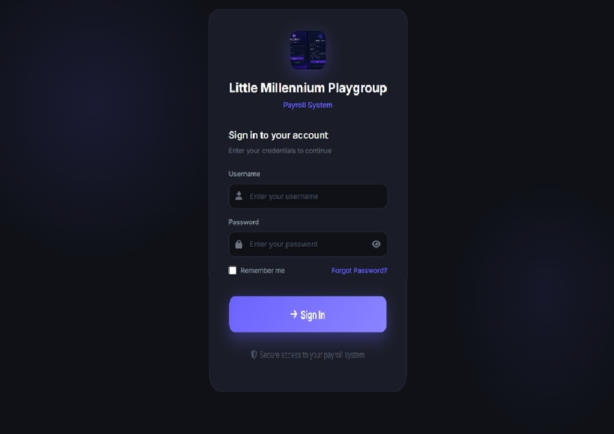 | 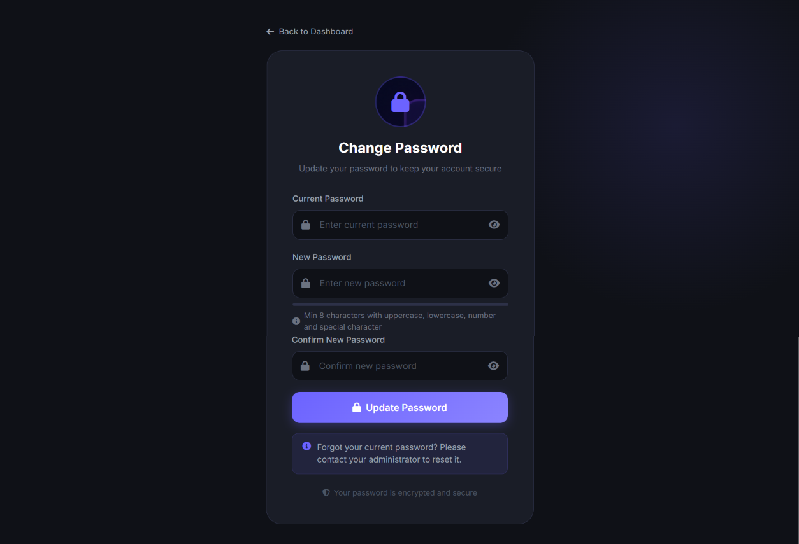 |

### 👩‍💼 Admin Panel
| Dashboard | Employees |
|---|---|
| 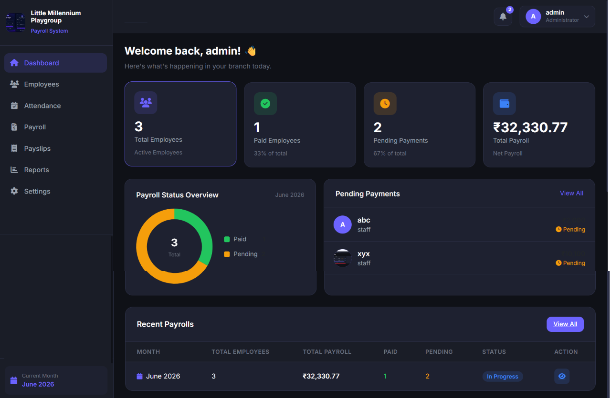 | 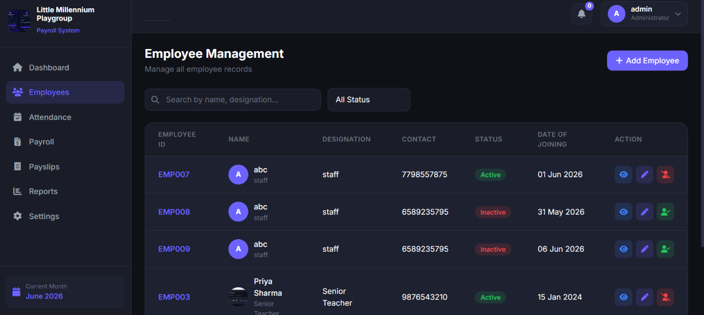 |

| Add Employee | View Employee |
|---|---|
| 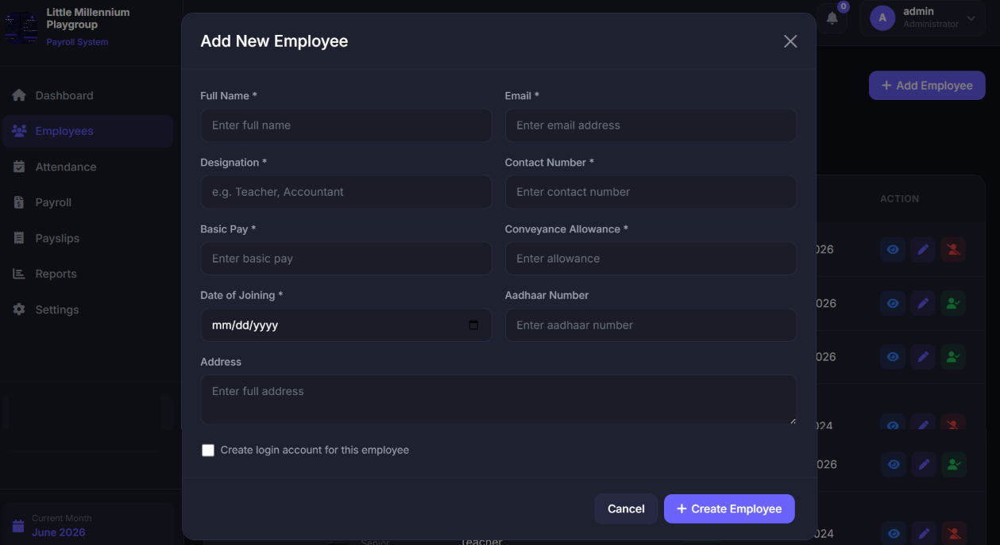 | 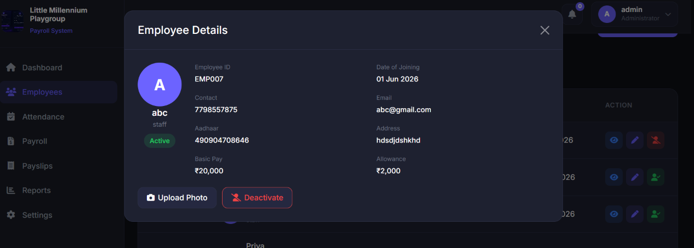 |

| Attendance | Payroll |
|---|---|
| 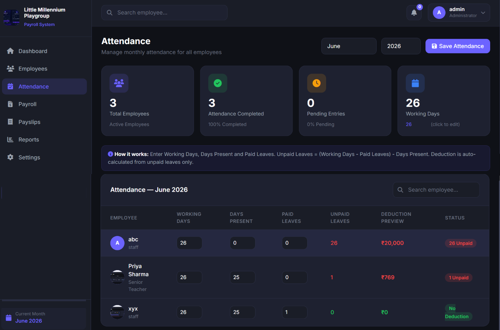 | 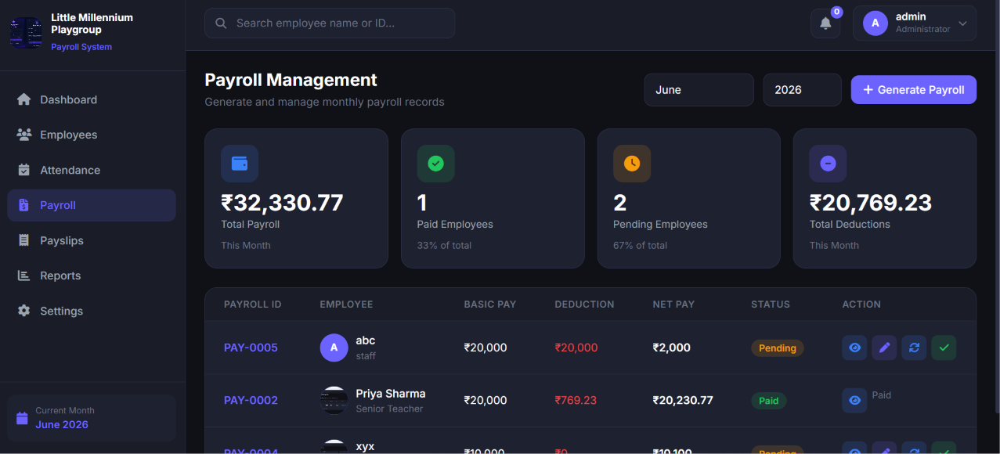 |

| Payroll Detail | Payslips |
|---|---|
| 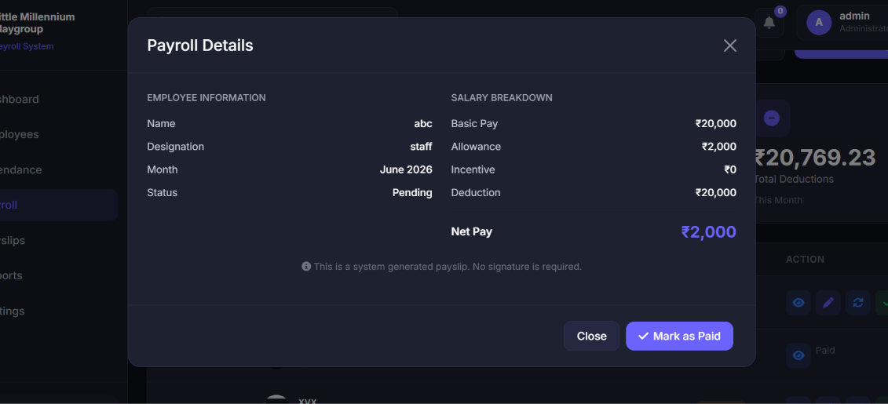 | 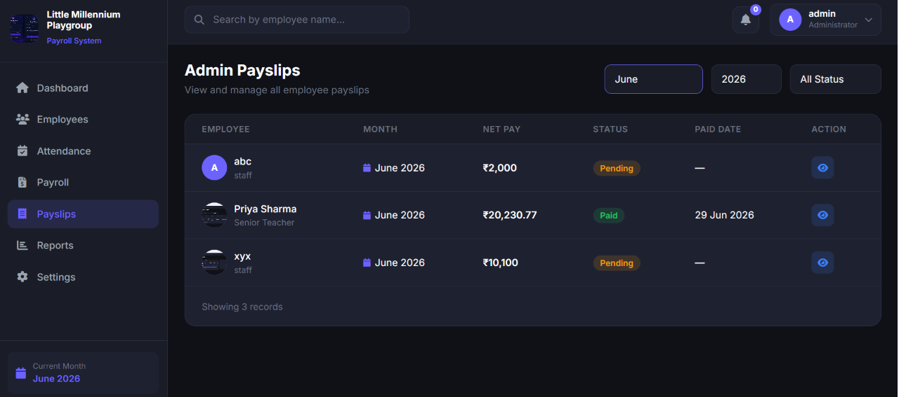 |

| Reports | Settings |
|---|---|
| 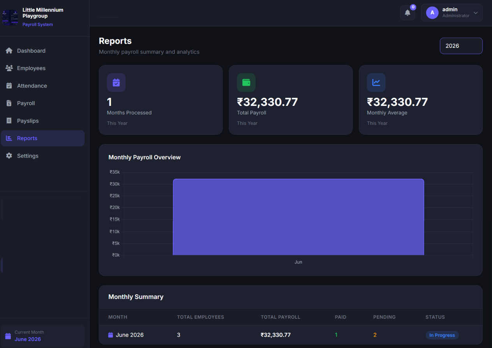 | 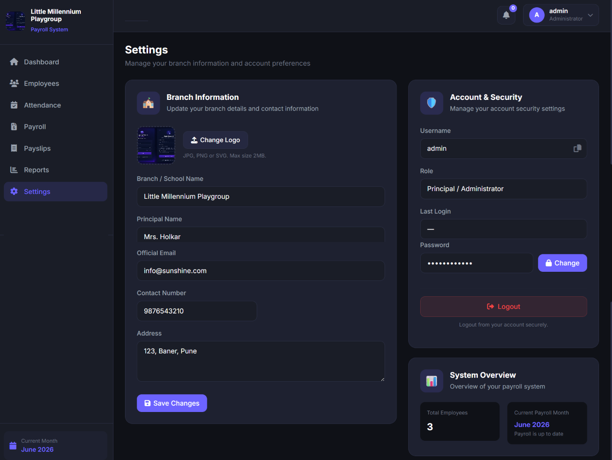 |

### 👩‍🏫 Employee Portal
| Dashboard | Profile |
|---|---|
| 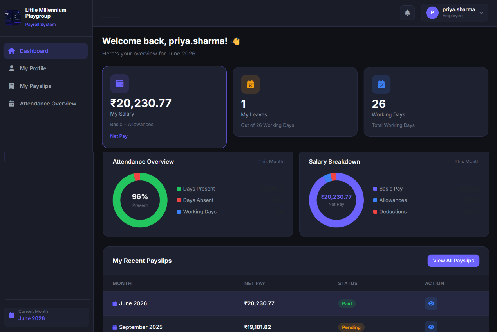 | 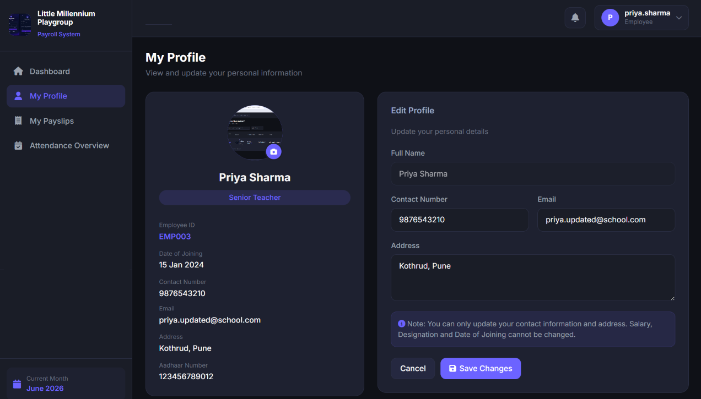 |

| Payslips | Attendance |
|---|---|
| 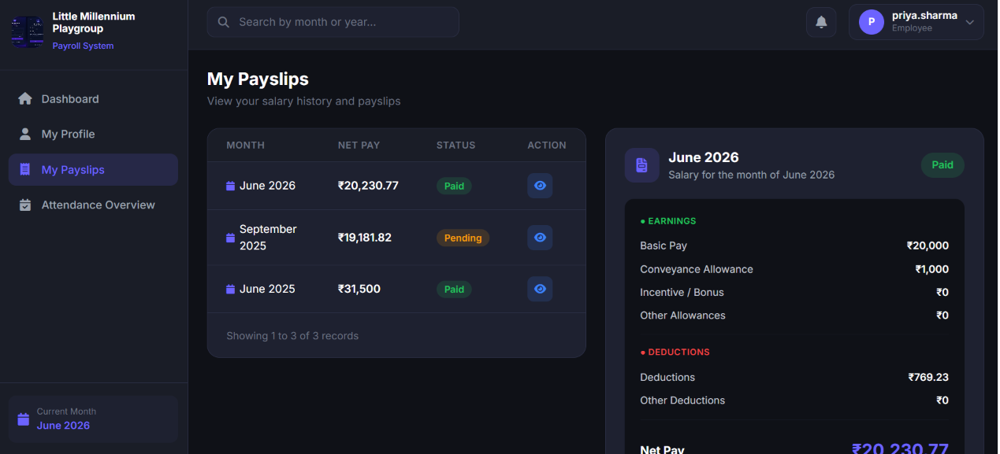 | 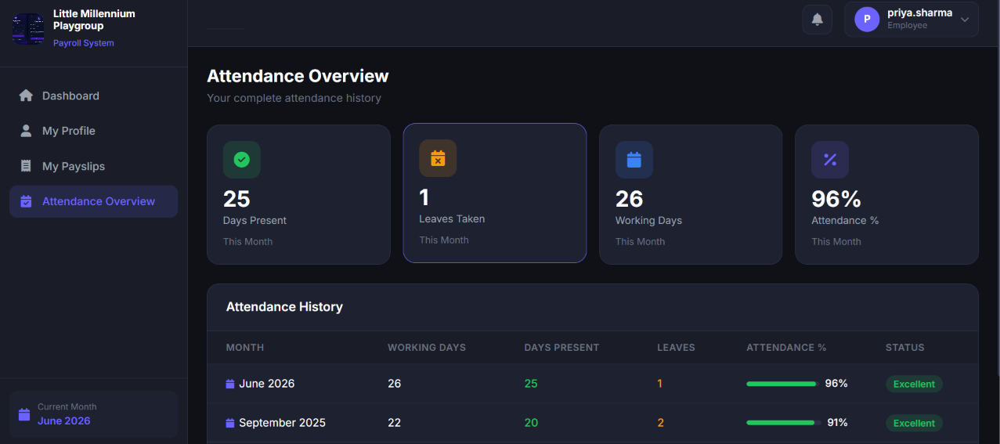 |

---

## ⚙️ Local Setup

### Prerequisites
- .NET 10 SDK
- PostgreSQL
- Node.js (optional, for Live Server)
- VS Code with Live Server extension

### Backend Setup

```bash
# Clone the repository
git clone https://github.com/YOUR_USERNAME/PayFlow.git

# Navigate to backend
cd PayFlow

# Restore packages
dotnet restore

# Update appsettings.json with your DB connection
# "DefaultConnection": "Host=localhost;Port=5432;Database=PayFlowDb;Username=postgres;Password=YOUR_PASSWORD"

# Run the API
dotnet run --project PayFlow.API
```

### Database Setup

1. Create database in PostgreSQL:
```sql
CREATE DATABASE PayFlowDb;
```

2. Run the schema file in pgAdmin Query Tool:
```
Open payflow_schema.sql → Run all
```

3. Generate admin password hash using the temp endpoint:
```
GET http://localhost:5091/api/auth/generate-hash
```

4. Update admin password in Users table:
```sql
UPDATE "Users" SET "PasswordHash" = 'YOUR_HASH' WHERE "Username" = 'admin';
```

### Frontend Setup

```bash
# Navigate to frontend
cd PayFlow.Frontend

# Open in VS Code
code .

# Right click index.html → Open with Live Server
# Opens at http://127.0.0.1:5500
```

### Default Login
```
Username: admin
Password: Admin@123
```

---

## 🌐 Deployment (Free)

| Service | Purpose | Cost |
|---|---|---|
| Supabase | PostgreSQL Database | Free |
| Render.com | ASP.NET Core API | Free |
| Netlify | Frontend (HTML/JS) | Free |

**Total: ₹0/month**

---

## 🔮 Future Scope

- 📱 Flutter mobile app (API already built and ready)
- 📄 PDF payslip download
- 📧 Email notifications for payroll
- 🔔 Notification system
- 📊 Advanced analytics and reports
- 🏢 Multi-branch support
- 🤖 AI-based salary insights

---

## 👩‍💻 Developer

**Yashvi Nikam**
Junior Software Engineer Intern


[](https://github.com/Yashvi-Nikam)

---

## 📄 License

This project is developed for a real client and portfolio purposes.

---
